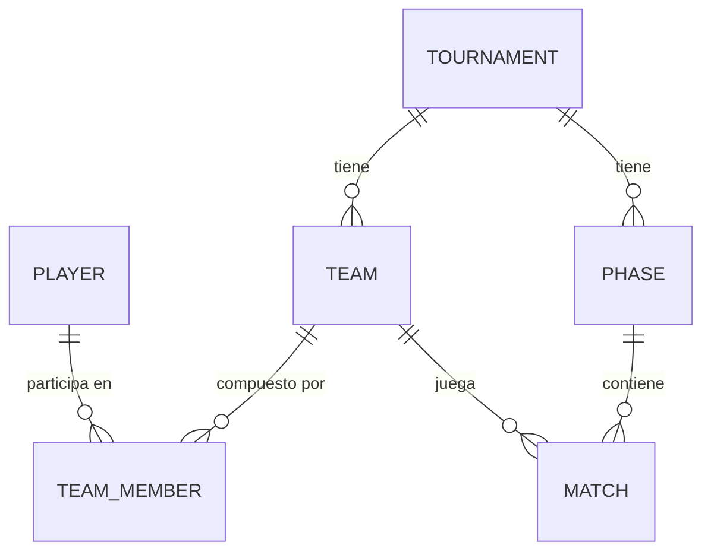

# Modelo de datos — Frikiparty

> Fuente de verdad del modelo de dominio antes de tocar el schema de Drizzle. Lo que hay debajo es un **EJEMPLO ilustrativo** (marcado como tal) solo para mostrar la estructura y el nivel de detalle esperado — bórralo y sustitúyelo por tu modelo real. No hace falta que sigas el formato al pie de la letra, es solo para que no se te quede nada sin cubrir.

## 1. Glosario

Términos del dominio, para que no haya ambigüedad de nombres al hablar de esto.

- **Edición**: la convocatoria anual del evento (ej. "Edición 2024"). Puede incluir el torneo de Age of the Ring y otros juegos de mesa.
- **Torneo**: la competición de Age of the Ring dentro de una edición. Fase de grupos + playoffs.
- **Equipo**: 3-4 jugadores agrupados para competir en un torneo concreto (no persiste entre ediciones salvo que se diga lo contrario).
- **Jugador**: una persona física que participa en una o más ediciones a lo largo de los años, con ranking histórico.
- **Fase**: una etapa del torneo (ej. "Fase de grupos", "Cuartos de final", "Final").
- **Partida**: un enfrentamiento entre dos equipos dentro de una fase.
- _(añade aquí cualquier término propio del juego o del grupo: bandos, facciones, formato de puntuación, apodos internos, etc. — cualquier palabra que uses y yo pueda no conocer)_

## 2. Entidades

Para cada entidad: qué es, sus campos, y sus relaciones con otras. Ejemplo de nivel de detalle:

### Player (jugador)

Persona que participa en una o más ediciones. Vive fuera de una edición concreta para poder tener ranking histórico entre años.

| Campo | Tipo | Notas |
|---|---|---|
| id | uuid | |
| name | string | nombre para mostrar |
| userId | FK → user.id (better-auth), nullable | un jugador puede no tener cuenta todavía |
| createdAt | timestamp | |

**Preguntas abiertas de ejemplo** (así es como quiero que me marques las tuyas):
- ¿Un Player siempre tiene un User de better-auth, o puede existir "en la sombra" (alguien que jugó en 2007 y nunca se ha registrado en la web)?
- ¿Se puede vincular un Player-sombra a un User cuando esa persona se registra más tarde?

### Edition (edición)

_(rellena igual: campos, relaciones, dudas)_

### Tournament (torneo)

_(¿un torneo pertenece siempre a una edición 1:1, o una edición puede tener varios torneos — Age of the Ring + otro juego?)_

### Team (equipo)

_(¿el nombre de equipo es libre? ¿puede repetirse entre ediciones? ¿tiene escudo/color?)_

### TeamMember (jugador dentro de un equipo, para un torneo concreto)

### Phase (fase)

_(¿grupos y playoffs son el único formato posible, o quieres que sea configurable por torneo?)_

### Match (partida)

_(¿qué se guarda de una partida? ¿resultado simple (gana/pierde), puntos, bando jugado por cada equipo, duración, quién iba de Free Peoples / Shadow?)_

### Standing (clasificación)

_(¿se guarda como tabla o se calcula al vuelo a partir de los resultados de Match?)_

## 3. Relaciones (resumen)

En texto o con un diagrama mermaid, lo que te resulte más cómodo. Ejemplo:

## 4. Reglas de negocio / invariantes

Cosas que el modelo debe garantizar o que la app debe validar. Ejemplo:

- Un equipo tiene entre 3 y 4 jugadores.
- Un jugador no puede estar en dos equipos del mismo torneo.
- La fase de grupos se cierra antes de empezar playoffs.
- El ranking histórico de un jugador, ¿se recalcula siempre o se guarda como snapshot por edición?

## 5. Casos límite / dudas

Cosas sin decidir del todo, para no perderlas de vista:

- ¿Qué pasa si un jugador abandona a mitad de torneo?
- ¿Cómo se desempata en fase de grupos?
- ¿Puede un equipo tener menos de 3 jugadores si alguien no se presenta?

## 6. Fuera de alcance (por ahora)

Cosas que existen en el dominio real pero que conscientemente NO quieres modelar todavía, para que no se cuelen sin querer en el diseño.
